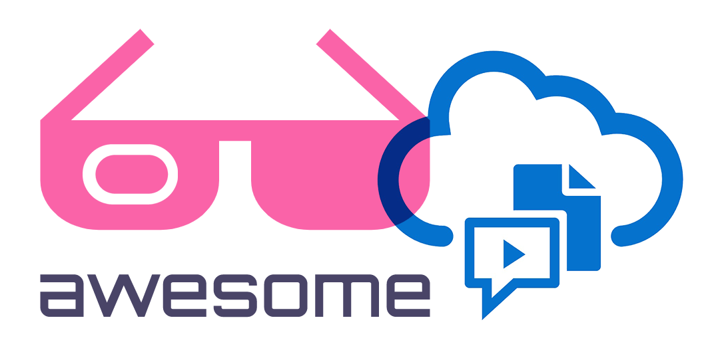

   
  
   
   

## Awesome Oracle Content Management (OCM) 

> A curated list of awesome things related to Oracle Content Management

- [Get Started](#get-started)
- [Resources](#resources)
  - [Official Resources](#official-resources)
  - [Samples](#samples)
- [Video](#video)
  - [Video Channels](#video-channels)
- [Blogs](#resources)
  - [Official Blogs](#official-blogs)
  - [Developer Blogs](#developer-blogs)
  - [Partner Blogs](#partner-blogs)
- [GitHub](#github)

# Get Started
 - [OCM Homepage](https://www.oracle.com/uk/content-management)
 - [Documentation](https://docs.oracle.com/en/cloud/paas/content-cloud/)
 - [API](https://docs.oracle.com/en/cloud/paas/content-cloud/apisdk.html)
 - [Downloads](https://www.oracle.com/content-management/technologies/downloads/)
 - [Solutions & Architecture](https://docs.oracle.com/solutions/?q=&cType=reference-architectures%2Csolution-playbook%2Cbuilt-deployed&sort=date-desc&lang=en)

# Resources

### Official Resources
- [Oracle Content Management Toolkit](https://github.com/oracle/content-and-experience-toolkit)
- [Oracle Content Management SDK](https://github.com/oracle/content-management-sdk)
- [Oracle Content Management Cloud SDK for Browsers](https://github.com/oracle/content-sdk-for-browser)
- [Oracle Content Management Cloud SDK for Node.js](https://github.com/oracle/content-sdk-for-nodejs)
- [Books](https://docs.oracle.com/en/cloud/paas/content-cloud/books.html)

### Samples
- [Oracle Samples](https://docs.oracle.com/en/cloud/paas/content-cloud/samples.html)

# Video

### Video Channels
 - [Training](https://docs.oracle.com/en/cloud/paas/content-cloud/videos.html)
 - [Video Hub](https://videohub.oracle.com/tag?tagid=ocm)

# Blogs

# Official Blogs
- [Oracle](https://blogs.oracle.com/content-management/)
- [Oracle Dev Tools & Samples](https://blogs.oracle.com/content-management/category/ocm-developer-tools-and-samples)
- [PM | Preston So](https://blogs.oracle.com/authors/preston-so)
- [PM | Razvan Teodorescu](https://blogs.oracle.com/authors/razvan-teodorescu)
- [PM | Ankur Saxena](https://blogs.oracle.com/authors/ankur-saxena)
- [PM | Monte Kluemper](https://blogs.oracle.com/authors/monte-kluemper-x)
- [PM | Chris DeGrace](https://blogs.oracle.com/authors/chris-degrace)
- [PM | Mark Paterson](https://blogs.oracle.com/authors/mark-paterson)
- [Architect | Mark Fincham](https://blogs.oracle.com/authors/mark-fincham)
- [A-Team | Dolf Dijkstra](https://blogs.oracle.com/authors/dolf-dijkstra)

# Developer Blogs
- [BitmapBytes](https://bitmapbytes.com)
- [PM | Preston So](https://preston.so)
- [PM | Igor Polyakov - Musings About Technology](https://igor-polyakov.com)
- [CoreContentOnly](https://www.corecontentonly.com/)
- [@oceblogger](https://medium.com/@oceblogger)
- [@oceblogger](https://medium.com/@oceblogger)

# Partner Blogs
- [Fishbbowl Solutions](https://fishbowlsolutions.com/blog)

## Contribute

Contributions welcome! Read the [contribution guidelines](contributing.md) first.

## License

To the extent possible under law, John Sim has waived all copyright and
related or neighboring rights to this work.
